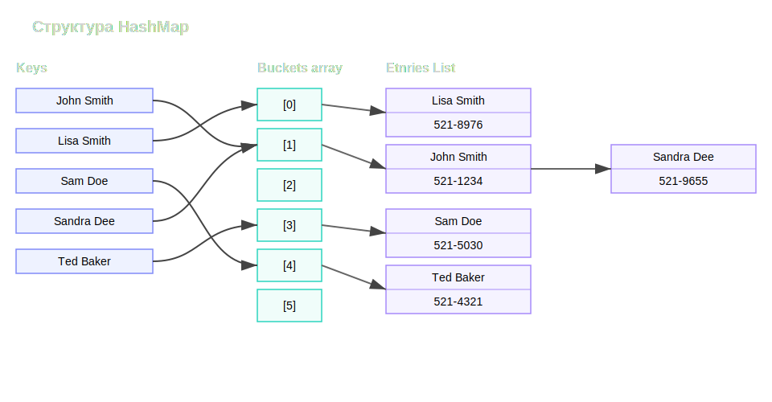
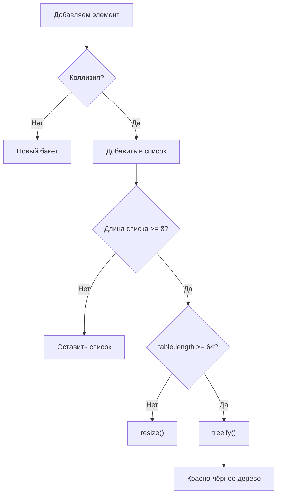

# HashMap
**HashMap** - это структура данных для хранения пар: **ключ → значение**.
**HashMap** позволяет очень быстро <u>добавлять / искать / удалять</u> элементы по ключу. Средняя сложность **О(1)**
Пример:
```java
Map<String, Integer> map = new HashMap<>();

map.put("Alice", 25);
map.put("Bob", 30);
```
## Устройство HashMap
Внутри массив бакетов (bucket[]). В каждом бакете список элементов или дерево (в новых версиях Java).
## Как происходит put()
### 1. Вычисляется hashCode()
```java
key.hashCode();
```
### 2. Hash преобразуется в индекс массива
В современных реализациях HashMap (начиная с Java 8) индекс вычисляется так:
```java
int hash = key.hashCode();
hash ^= (hash >>> 16); // Перемешивание старших битов
int index = (table.length - 1) & hash;
```
Где:
- table.lengh - размер внутреннего массива бакетов (всегда степень двойки: 16, 32, 64. ...).
- hashCode() может вернуть любое 32-битное число.
- hash ^= (hash >>> 16) смешивает старшие и младшие биты, чтобы уменьшить количество коллизий.
- (length - 1) & hash - быстрый аналог операции % length, но работает только потому, что размер массива - степень двойки.
Пример:
```java
hash = 12345;
length = 16;

index = (16 - 1) & 12345
	  = 15 & 12345
	  = 9
```
$$
\begin{array}{rcl}  
12345 &=& 0011\ 0000\ 0011\ 1001 \\  
15 &=& 0000\ 0000\ 0000\ 1111 \\  
\hline  
9 &=& 0000\ 0000\ 0000\ 1001  
\end{array}  
$$
То есть объект попадет в бакет с индексом 9.
Краткая формула:
```java
index = (table.length - 1) & (hashCode ^ (hashCode >>> 16))
```
### 3. Элемент кладется в бакет
- Если бакет пуст - просто вставка
- Если нет:
	- проверка ключей через equals()
		- либо обновление (если ключ найден)
		- либо добавление в цепочку (если ключ не найден)
Коллизия - случай, когда разные ключи имеют одинаковый индекс бакета.
- В старых версиях Java при коллизиях ключи хранятся в виде связного списка
- В Java 8+ изначально хранятся в виде связного списка, затем, при большом количестве коллизий перерождается в красно-черное дерево.

## Основные методы

| Метод                                      | Описание                                               |
| ------------------------------------------ | ------------------------------------------------------ |
| `put(K key, V value)`                      | Добавить или обновить значение                         |
| `get(Object key)`                          | Получить значение по ключу                             |
| `remove(Object key)`                       | Удалить запись по ключу                                |
| `containsKey(Object key)`                  | Проверить наличие ключа                                |
| `containsValue(Object value)`              | Проверить наличие значения                             |
| `size()`                                   | Количество элементов                                   |
| `isEmpty()`                                | Проверить, пуста ли карта                              |
| `clear()`                                  | Очистить карту                                         |
| `putAll(Map<? extends K, ? extends V> m)`  | Добавить все записи из другой карты                    |
| `keySet()`                                 | Получить множество ключей                              |
| `values()`                                 | Получить коллекцию значений                            |
| `entrySet()`                               | Получить множество пар ключ-значение (Entry)           |
| `putIfAbsent(K key, V value)`              | Добавить значение только если ключа еще нет            |
| `getOrDefault(Object key, V defaultValue)` | Возвращает значение по ключу или значение по умолчанию |
| `replace(K key, V value)`                  | Заменяет значение существующего ключа                  |
