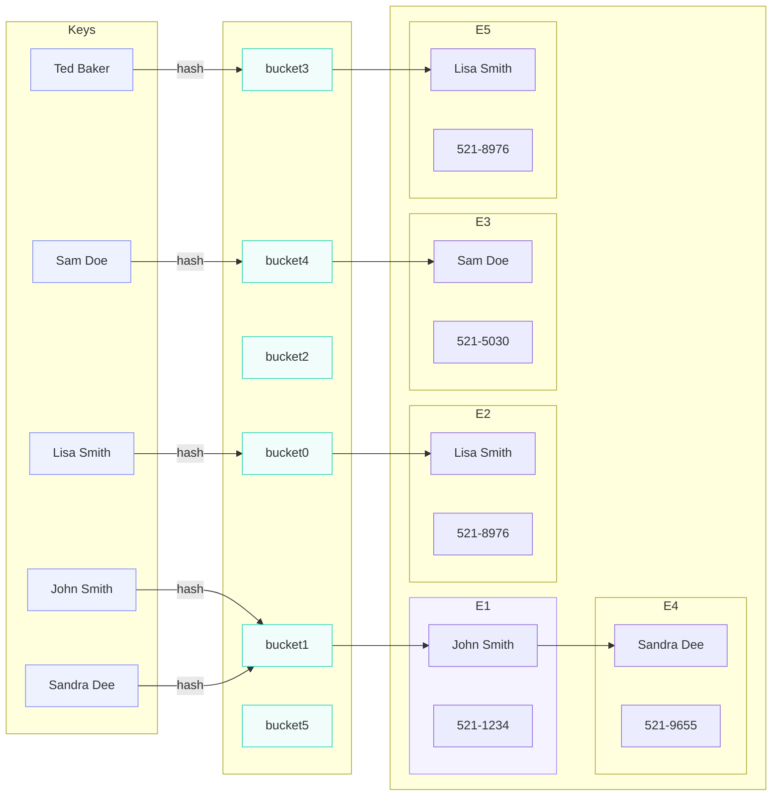

# HashMap
**HashMap** - это структура данных для хранения пар: **ключ → значение**.
**HashMap** позволяет очень быстро <u>добавлять / искать / удалять</u> элементы по ключу. Средняя сложность **О(1)**
Пример:
```java
Map<String, Integer> map = new HashMap<>();

map.put("Alice", 25);
map.put("Bob", 30);
```
## Устройство HashMap
