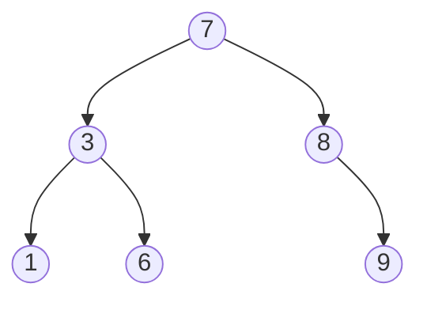
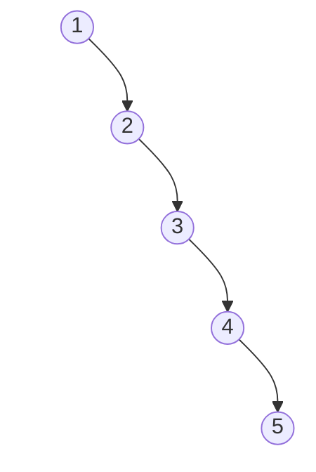

# TreeMap
TreeMap - это реализация Map, основанная на красно-черном дереве. Главное отличие от HashMap - TreeMap хранит ключи отсортированными.
### Бинарное дерево поиска (BST)
Идея BST: для каждого узла `left < node < right`. Сложность O(log n) (но только если дерево сбалансировано).
#### Пример:

#### Поиск
Ищем 6:
```
6 < 8 -> влево
6 > 3 -> вправо
нашли
```
#### Проблема обычного BST
Если добавлять `1, 2, 3, 4, 5`, получится обычный связный список (поиск O(n)):

Решение: самобалансирующееся дерево.
### Красно-черное дерево
Красно-черное дерево автоматически перестраивается и поддерживает баланс. В красно-черном дереве каждый узел имеет цвет (RED, BLACK).
#### Правила красно-черного дерева
1. Каждый узел:
	- красный
	- или черный
2. Корень всегда черный
3. Красный узел не может иметь красного ребенка