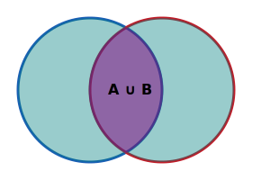

# JOIN
В SQL JOIN - это ключевая операция для объединения строк из двух (или более) таблиц на основе логической связи между ними. Чаще всего связь идет по первичному и внешнему ключу.

Есть 5 основных типов JOIN-ов, и каждый решает свою задачу.
## 1. INNER JOIN - внутреннее соединение

- Выдает только те строки, где в обеих таблицах есть совпадение по условию соединения.
- Формула: "Дай мне пересечение таблиц"
- Пример:
```sql
SELECT employees.name, departments.name
FROM employees
INNER JOIN departments ON employees.dept_id = departments.id;
```
- Вернет только тех сотрудников, у которых есть отдел.
## 2. LEFT JOIN (LEFT OUTER JOIN) - левое внешнее соединение

- Возвращает все строки из левой таблицы, даже если в правой нет соответствий.
- Если нет совпадения - поля из правой таблицы будут NULL.
- Пример:
```sql
SELECT employees.name, departments.name
FROM employees
LEFT JOIN departments ON employees.dept_id = departments.id;
```
- Вернет всех сотрудников, даже если они не прикреплены к отделу.
## RIGHT JOIN (RIGHT OUTER JOIN) - правое внешнее соединение

- Противоположность LEFT JOIN: все строки из правой таблицы, даже без совпадений слева.
- Пример:
```sql
SELECT employees.name, departments.name
FROM employees
RIGHT JOIN departments ON employees.dept_id = departments.id;
```
- Покажет все отделы, даже если в них нет сотрудников.
## 4. FULL JOIN (FULL OUTER JOIN) - полное внешнее соединение

- Возвращает все строки из обеих таблиц.
- Где нет совпадений - заполняется NULL.
- Пример:
```sql
SELECT employees.name, departments.name
FROM employees
FULL OUTER JOIN departments ON employees.dept_id = departments.id;
```
- Вернет всех сотрудников и все отделы, включая одиночные записи без пар.
## 5. CROSS JOIN - декартово произведение

- Соединяет каждую строку одной таблицы с каждой строкой другой таблицы.
- Используется редко, чаще в генерации тестовых данных или переборе комбинаций.
- Пример:
```sql
SELECT a.name, b.color
FROM shirts a
CROSS JOIN colors b;
```
- Если 3 футболки и 5 цветов, то получим 15 строк (все возможные сочетания).
## Как работает ON, USING, NATURAL

| Оператор     | Как работает                                                                                                        |
| ------------ | ------------------------------------------------------------------------------------------------------------------- |
| ON           | Указывается явно условие соединения<br>`JOIN B ON A.id = B.a_id`                                                    |
| USING        | Упрощенная форма, если столбцы имеют одно и то же имя<br>`JOIN B USING (id)`                                        |
| NATURAL JOIN | Сам выбирает столбцы по одинаковым именам - может вести себя непредсказуемо, не рекомендуется для сложных запросов. |
