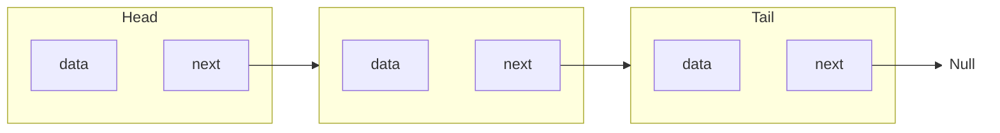
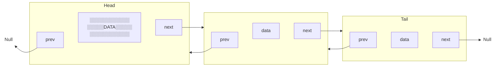

# Лабораторная работа №3. Работа со ссылками, вложенные классы
## 1. Односвязный список
Реализуйте класс, хранящий набор значений при помощи односвязного списка. Напишите программу, иллюстрирующую использование класса.
Односвязный список - это структура, хранящая данные в виде цепочки, каждый узел которой хранит очередное значение списка и ссылку на следующий узел (см. рис.). Ссылка на следующий узел последнего элемента списка равна null.

Класс, реализующий односвязный список, должен содержать следующие методы:
- добавление значения в начало списка;
- извлечение значения из начала списка без его удаления из списка;
- извлечение значения из начала списка с удалением из списка;
- добавление значения в конец списка;
- извлечение значения из конца списка без его удаления;
- извлечение значения из конца списка с удалением;
- определение, содержит ли список заданное значение, или нет;
- определение, является ли список пустым, или нет;
- печать всех значений списка;
- **\* удаление заданного значения из списка; если значения в списке нет, то ничего происходить не должно;**
- **\* выполнение действия, заданного в параметре метода, для каждого значения из списка.**
## 2. Двусвязный список
Реализуйте класс, хранящий набор значений при помощи двусвязного списка. Напишите программу, иллюстрирующую использование класса.

Двусвязный список - это структура, хранящая данные в виде цепочки, каждый узел которой хранит очередное значение списка, а также ссылки на предыдущий и следующий узлы (см. рис.). Ссылка на следующий узел за последним и предыдущий перед первым равна *null*.
