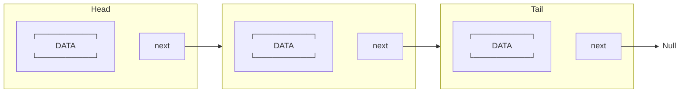
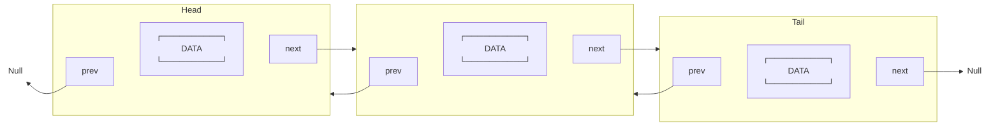
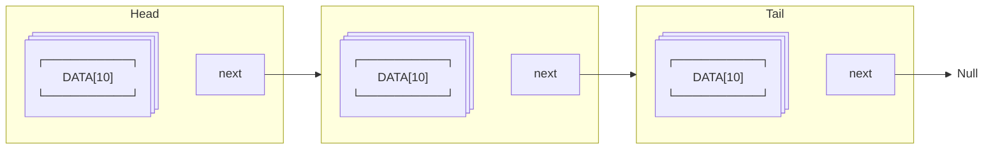

# Лабораторная работа №3. Работа со ссылками, вложенные классы
## 1. Односвязный список
Реализуйте класс, хранящий набор значений при помощи односвязного списка. Напишите программу, иллюстрирующую использование класса.
Односвязный список - это структура, хранящая данные в виде цепочки, каждый узел которой хранит очередное значение списка и ссылку на следующий узел (см. рис.). Ссылка на следующий узел последнего элемента списка равна null.

Класс, реализующий односвязный список, должен содержать следующие методы:
- добавление значения в начало списка;
- извлечение значения из начала списка без его удаления из списка;
- извлечение значения из начала списка с удалением из списка;
- добавление значения в конец списка;
- извлечение значения из конца списка без его удаления;
- извлечение значения из конца списка с удалением;
- определение, содержит ли список заданное значение, или нет;
- определение, является ли список пустым, или нет;
- печать всех значений списка;
- **\* удаление заданного значения из списка; если значения в списке нет, то ничего происходить не должно;**
- **\* выполнение действия, заданного в параметре метода, для каждого значения из списка.**
## 2. Двусвязный список
Реализуйте класс, хранящий набор значений при помощи двусвязного списка. Напишите программу, иллюстрирующую использование класса.

Двусвязный список - это структура, хранящая данные в виде цепочки, каждый узел которой хранит очередное значение списка, а также ссылки на предыдущий и следующий узлы (см. рис.). Ссылка на следующий узел за последним и предыдущий перед первым равна *null*.

Реализуйте те же самые методы, что реализованы для класса односвязного списка.
Кроме того, реализуйте следующие методы:
- добавление всех значений заданного массива в начало списка; порядок значений должен сохраняться - первое значение массива должно стать первым значением списка;
- добавление всех значений заданной коллекции в начало списка с сохранением порядка; коллекция - любой объект, реализующий интерфейс java.lang.Iterable;
- добавление всех значений заданного массива/коллекции (два метода) в конец списка с сохранением порядка;
- поглощение списка другим списком с добавлением значений второго в начало/конец (два метода) первого списка; после поглощения второй список должен очищаться;
- печать всех значений списка в прямом/обратном порядке (два метода);
- **\* выполнение действия, заданного в параметре метода, для каждого  значения списка в прямом/обратном порядке (два метода).**
## 3. Развернутый односвязный список
Реализуйте класс, хранящий набор значений при помощи развернутого  односвязного списка. Напишите программу, иллюстрирующую использование класса.

Развернутый односвязный список - это обобщение односвязного списка. Отличие состоит в том, что каждый узел цепочки хранит не одно, а несколько значений в обычном массиве (см. рис.). При добавлении значения в список он записывается в массив узла. Если в массиве место закончилось, то создается следующий узел и значение попадает в него. Размер массива в каждом узле фиксирован и обычно не велик (порядка 10). Ссылка на следующий узел за последним равна null.

Реализуйте те же самые методы, что реализованы для класса односвязного списка.
Кроме того, реализуйте следующие методы:
- добавление всех значений заданного массива в начало списка; порядок элементов должен сохраняться - первый элемент массива должен стать первым элементом списка;
- добавление всех значений заданной коллекции в начало списка с сохранением порядка; коллекция - любой объект, реализующий интерфейс java.lang.Iterable;
- добавление всех значений заданного массива/коллекции (два метода) в конец списка с сохранением порядка;
- поглощение списка другим развернутым списком с добавлением значений второго в начало/конец первого списка (два метода); после поглощения второй список должен очищаться;
- **\* выполнение действия, заданного в параметре метода, для каждого значения списка.**