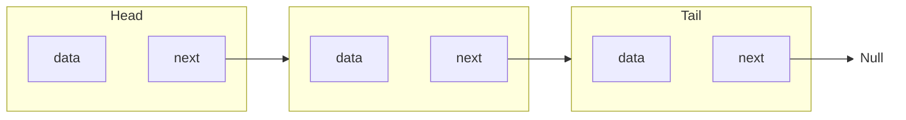

# Лабораторная работа №3. Работа со ссылками, вложенные классы
## 1. Односвязный список
Реализуйте класс, хранящий набор значений при помощи односвязного списка. Напишите программу, иллюстрирующую использование класса.
Односвязный список - это структура, хранящая данные в виде цепочки, каждый узел которой хранит очередное значение списка и ссылку на следующий узел (см. рис.). Ссылка на следующий узел последнего элемента списка равна null.

