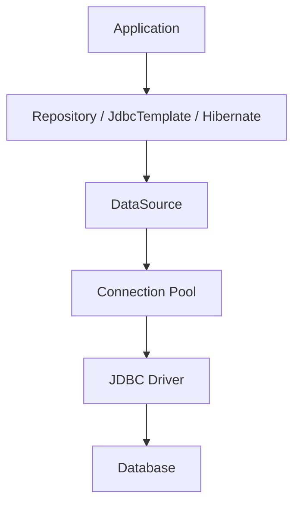
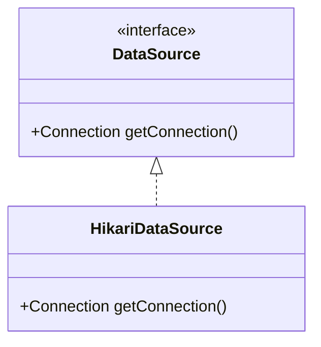
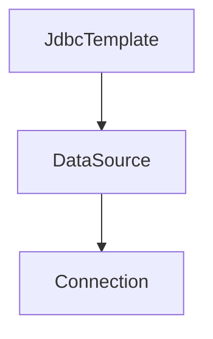
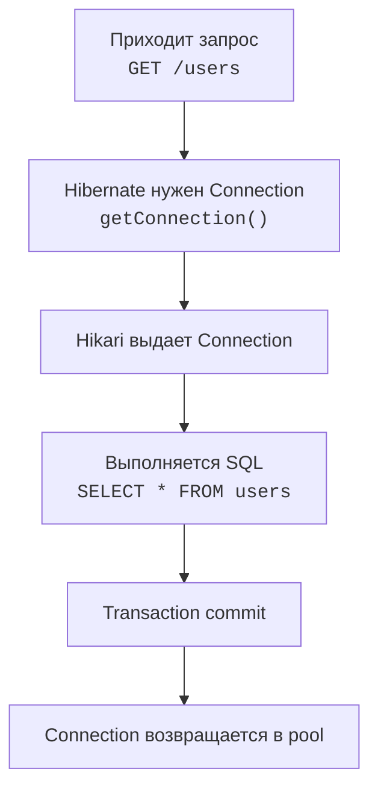
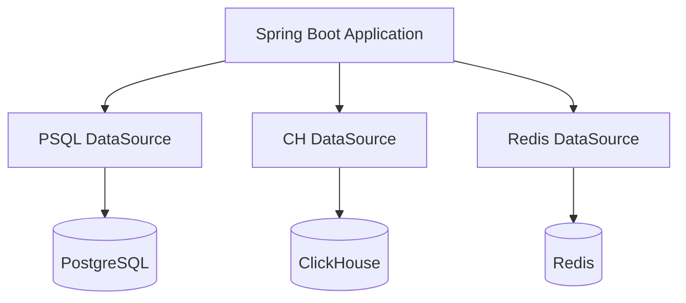
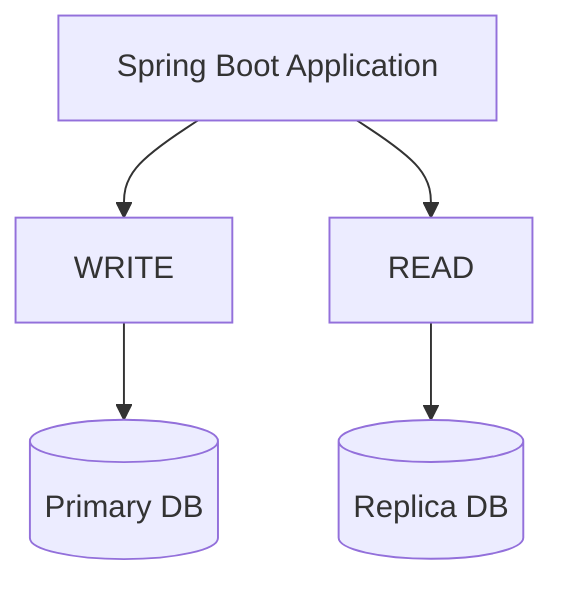
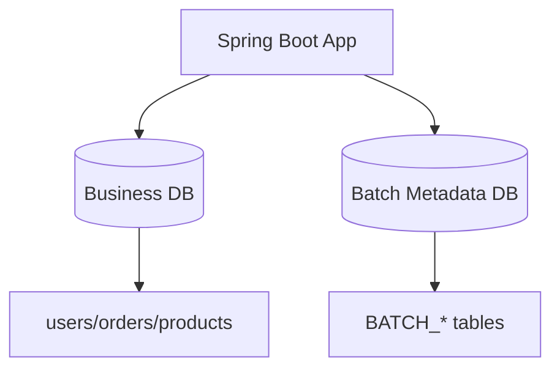
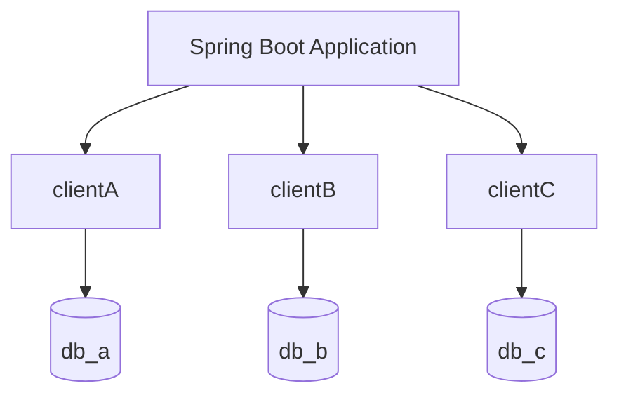

# DataSource
DataSource - это объект, через который приложение получает подключения к базе данных. Без него ни JPA, ни JdbcTemplate, ни Hibernate работать не смогут.
Когда приложение работает с базой данных, ему нужно:
1. Знать, куда подключаться (URL базы)
2. Знать логин и пароль
3. Уметь создавать соединения
4. Переиспользовать их, а не открывать заново каждый раз
Именно этим и занимается DataSource.
### Как выглядит работа без DataSource
Обычный JDBC:
```java
Connection connection = DriverManager.getConnection(
	"jdbc:postgresql:localhost:5432/shop",
	"user",
	"password"
)
```
Каждый раз открывается новое соединение, тратятся ресурсы. Это медленно, сложно управлять. SpringBoot делает это централизованно через DataSource.
### Главная идея Spring Boot
В Spring Boot, в application.yml необходимо просто прописать:
```yaml
spring:
	datasource:
		url: jdbc:postgresql://localhost:5432/shop
		username: postgres
		password: 1234
```
И Spring Boot автоматически:
- Создаст DataSource
- Подключит пул соединений
- Настроит Hibernate
- Свяжет все с JPA
- Создаст JdbcTemplate
- Будет управлять транзакциями
## Архитектура:

### 1. Database
Это сама база (Postgresql, MySQL, Oracle, H2, MariaDB)
### 2. JDBC Driver
Java не умеет напрямую говорить с PostgreSQL. Нужен драйвер, например:
```gradle
implementation 'org.postgresql:postgresql'
```
Этот драйвер:
- Понимает протокол PostgreSQL
- Умеет создавать TCP-соединения
- Преобразует SQL-запросы
### 3. Connection
Это физическое соединение с БД.
```java
java.sql.Connection
```
Через него идут:
```java
PreparedStatement
ResultSet
commit()
rollback()
```
#### Почему нельзя создавать Connection постоянно
Открытие соединения - очень дорогая операция:
- TCP handshake
- Аутентификация
- Создание server session
- Выделение памяти
Если каждый HTTP-запрос создавать новое соединение - приложение быстро умрет под нагрузкой.
Поэтому существует Connection Pool.
### 4. Connection Pool
Пул соединений хранит готовые соединения. Когда приложению нужен доступ к БД:
- пул выдает свободное соединение
- приложение использует его
- соединение возвращается обратно в пул
#### Что это дает
##### Скорость
Не нужно заново открывать TCP-соединение.
##### Ограничение нагрузки
Например:
```yaml
maximumPoolSize: 10
```
Значит одновременно будет максимум 10 соединений.
##### Контроль утечек
Пул может обнаружить:
- забытые соединения
- зависшие транзакции
- слишком долгие запросы
#### Какой пул использует Spring Boot
По умолчанию - HikariCP. Это очень быстрый современный пул. Spring Boot автоматически подключает его.
DataSource - это не сам пул.
DataSource - это интерфейс:
```java
javax.sql.DataSource
```
Главный метод:
```java
Connection getConnection()
```
А HikariCP - реализация.

## Что делает Spring Boot автоматически
Если Boot видит:
```yaml
spring:
	datasource:
		url: ...
```
и JDBC driver в зависимостях, он создает HikariDataSource автоматически.
### Как Boot понимает что создавать
Boot анализирует classpath. Если есть:
- postgresql driver
- HikariCP
- spring-jdbc
значит можно создать DataSource.
#### Условная автоконфигурация
Внутри Boot есть примерно такая логика:
```java
if (HikariCP exists) {
	create HikariDataSource
}

@Bean
public DataSource dataSource() {
	HikariDataSource ds = new HikariDataSource();
	
	ds.setJdbcUrl(...);
	ds.setUsername(...);
	ds.setPassword(...);
	
	return ds;
}
```
## Основные настройки DataSource
### DataSource
#### URL
```yaml
spring:
	datasource:
		url: jdbc:postgresql://localhost:5432/shop
```
**jdbc** - Протокол JDBC
**postgresql** - Тип БД
**localhost** - Хост
**5432** - Порт PostgreSQL
**shop** - Имя базы
#### Username/Password
```yaml
spring:
	datasource:
		username: postgres
		password: 1234
```
#### Driver
Обычно автоматически
```yaml
spring:
	datasource:
		driver-class-name: org.postgresql.Driver
```
### HikariCP
#### Размер пула
```yaml
spring:
	datasource:
		hikari:
			maximum-pool-size: 10
```
#### Минимум idle connections
```yaml
spring:
	datasource:
		hikari:
			minimum-idle: 5
```
Hikari старается держать минимум 5 свободных готовых соединений. Если часть соединений заняли запросы, пул может создать новые. Когда нагрузка спадет, снова оставит минимум 5 idle-соединений. Если количество активных соединений становится равным max-pool-size, то idle будет равен 0.
#### Timeout ожидания соединения
```yaml
spring:
	datasource:
		hikari:
			connection-timeout: 30000
```
Если свободных соединений нет - поток будет ждать 30 секунд, затем выбросит SQLException / timeout.
#### Maximum Lifetime
```yaml
spring:
	datasource:
		hikari:
			max-lifetime: 1800000 # не держать соединение дольше 30 минут
```
Максимальное время жизни одного JDBC-соединения в пуле.
##### Зачем это нужно:
1. БД может закрывать старые соединения
2. NAT/firewall/load balanser могут забывать соединения
3. Соединения могут становиться битыми или stale
#### Idle Timeout
```yaml
spring:
	datasource:
		hikari:
			idle-timeout: 600000
```
Сколько хранить неиспользуемое соединение
## Как приложение использует DataSource
### JdbcTemplate
```java
@Autowired
JdbcTemplate jdbcTemplate;
```
Внутри:

### JPA / Hibernate
```java
@Repository
interface UserRepository extends JpaRepository<User, Long>
```
## Транзакции
Spring:
- Берет Connection из DataSource
- Начинает transaction
- Commit/rollback
- Возвращает connection в pool
⚠️Connection не закрывается физически. Когда пишешь `connection.close();` в pool это означает: "вернуть соединение обратно в пул", а не реально закрыть TCP-соединение.
## Жизненный цикл запроса

## Несколько DataSource
Когда приложение работает не с одной базой данных или когда подключения должны иметь разное назначение, в Spring Boot могут создаваться несколько DataSource.
Пример:
```java
@Bean
@Primary
DataSource mainDataSource() {
}

@Bean
DataSource analyticsDataSource() {
}
```
### Самые частые случаи:
#### 1. Несколько разных БД
Например:
- PostgreSQL для основной бизнес-логики
- ClickHouse для аналитики
- Redis отдельно
- Oracle у legacy-сервиса


В таком случае создают:
```java
@Bean
DataSource mainDataSource()

@Bean
DataSource analytcsDataSource()
```
#### 2. Разделение read/write (replica setup)
Есть:
- master - запись
- replica - чтение

Это помогает:
- уменьшить нагрузку
- масштабировать чтение
#### 3. Микс JPA + batch processing
Например:
- Hibernate/JPA работает с основной БД
- Spring Batch использует отдельную БД для job metadata

#### 4. Мультиарендность (multi-tenant)
Когда у каждого клиента своя база

Тогда `RoutingDataSource` выбирает нужный `DataSource` динамически.
#### 5. Постепенная миграция со старой системы
Например:
- Старая БД - Oracle
- Новая БД - PostgreSQL
Приложение временно читает из обеих.
#### 6. Разные транзакционные требования
Иногда:
- Одна БД XA/JTA (распределенные транзакции)
- Другая обычная
Или:
- Одна connection pool c aggressive timeout
- Другая для long-running queries
## Embedded Database
Spring Boot умеет автоматически запускать:
- H2
- HSQLDB
- Derby
Если внешняя БД не настроена, очень удобно для тестов.