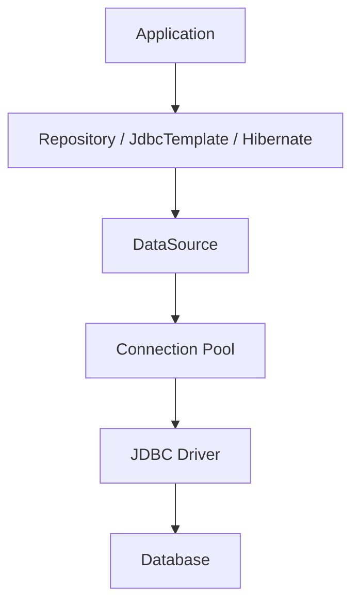
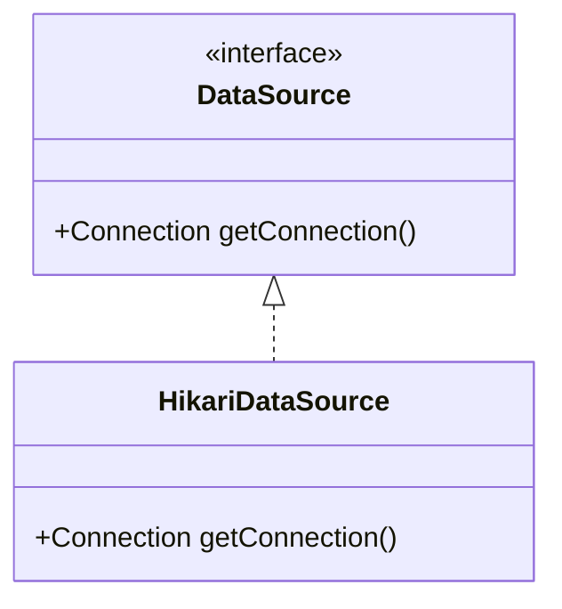

# DataSource
DataSource - это объект, через который приложение получает подключения к базе данных. Без него ни JPA, ни JdbcTemplate, ни Hibernate работать не смогут.
Когда приложение работает с базой данных, ему нужно:
1. Знать, куда подключаться (URL базы)
2. Знать логин и пароль
3. Уметь создавать соединения
4. Переиспользовать их, а не открывать заново каждый раз
Именно этим и занимается DataSource.
### Как выглядит работа без DataSource
Обычный JDBC:
```java
Connection connection = DriverManager.getConnection(
	"jdbc:postgresql:localhost:5432/shop",
	"user",
	"password"
)
```
Каждый раз открывается новое соединение, тратятся ресурсы. Это медленно, сложно управлять. SpringBoot делает это централизованно через DataSource.
### Главная идея Spring Boot
В Spring Boot, в application.yml необходимо просто прописать:
```yaml
spring:
	datasource:
		url: jdbc:postgresql://localhost:5432/shop
		username: postgres
		password: 1234
```
И Spring Boot автоматически:
- Создаст DataSource
- Подключит пул соединений
- Настроит Hibernate
- Свяжет все с JPA
- Создаст JdbcTemplate
- Будет управлять транзакциями
## Архитектура:

### 1. Database
Это сама база (Postgresql, MySQL, Oracle, H2, MariaDB)
### 2. JDBC Driver
Java не умеет напрямую говорить с PostgreSQL. Нужен драйвер, например:
```gradle
implementation 'org.postgresql:postgresql'
```
Этот драйвер:
- Понимает протокол PostgreSQL
- Умеет создавать TCP-соединения
- Преобразует SQL-запросы
### 3. Connection
Это физическое соединение с БД.
```java
java.sql.Connection
```
Через него идут:
```java
PreparedStatement
ResultSet
commit()
rollback()
```
#### Почему нельзя создавать Connection постоянно
Открытие соединения - очень дорогая операция:
- TCP handshake
- Аутентификация
- Создание server session
- Выделение памяти
Если каждый HTTP-запрос создавать новое соединение - приложение быстро умрет под нагрузкой.
Поэтому существует Connection Pool.
### 4. Connection Pool
Пул соединений хранит готовые соединения. Когда приложению нужен доступ к БД:
- пул выдает свободное соединение
- приложение использует его
- соединение возвращается обратно в пул
#### Что это дает
##### Скорость
Не нужно заново открывать TCP-соединение.
##### Ограничение нагрузки
Например:
```yaml
maximumPoolSize: 10
```
Значит одновременно будет максимум 10 соединений.
##### Контроль утечек
Пул может обнаружить:
- забытые соединения
- зависшие транзакции
- слишком долгие запросы
#### Какой пул использует Spring Boot
По умолчанию - HikariCP. Это очень быстрый современный пул. Spring Boot автоматически подключает его.
DataSource - это не сам пул.
DataSource - это интерфейс:
```java
javax.sql.DataSource
```
Главный метод:
```java
Connection getConnection()
```
А HikariCP - реализация.

## Что делает Spring Boot автоматически
Если Boot видит:
```yaml
spring:
	datasource:
		url: ...
```
и JDBC driver в зависимостях, он создает HikariDataSource автоматически.
### Как Boot понимает что создавать
Boot анализирует classpath. Если есть:
- postgresql driver
- HikariCP
- spring-jdbc
значит можно создать DataSource.
#### Условная автоконфигурация
Внутри Boot есть примерно такая логика:
```java
if (HikariCP exists) {
	create HikariDataSource
}

@Bean
public DataSource dataSource() {
	HikariDataSource ds = new HikariDataSource();
	
	ds.setJdbcUrl(...);
	ds.setUsername(...);
	ds.setPassword(...);
	
	return ds;
}
```