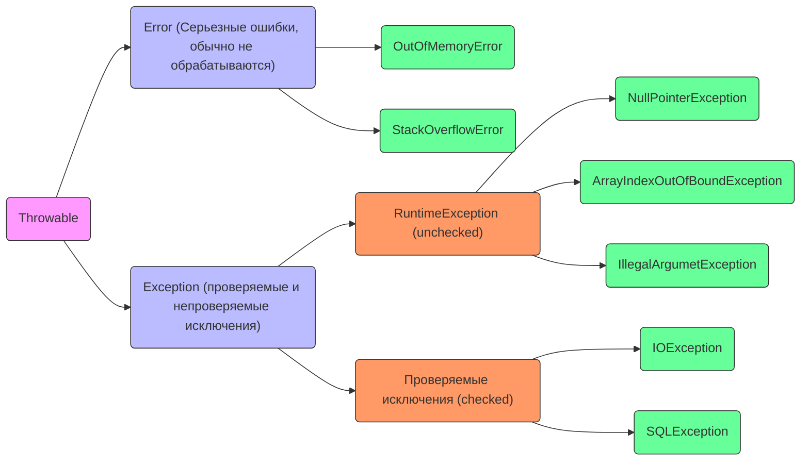

**Исключения (exceptions)** - это механизм обработки ошибок и нестандартных ситуаций, возникающих во время выполнения программы. Они позволяют отделить нормальный поток выполнения от обработки ошибок, делая код более надежным и читаемым.
# Иерархия исключений
Все исключения в Java являются подклассами *java.lang.Throwable*:

## Error (Ошибки)
Не обрабатываются в коде (обычно приводят к аварийному завершению программы).
## Exception (Исключения)
Делятся на:
- Проверяемые (*checked*)
- Непроверяемые (*unchecked*)
### Проверяемые исключения (checked exception)
- Обязательны к обработке (иначе код не скомпилируется).
- Возникают в "ожидаемых" ошибках (например, работа с файлами, сетью, БД).
Примеры:
- **IOException** - ошибка ввода-вывода
- **SQLException** - ошибка SQL-запроса
- **ClassNotFoundException** - класс не найден
### Непроверяемые исключения (unchecked exception)
- Не требуют обязательной обработки (но можно перехватить).
- Обычно возникают из-за ошибок в логике программы.
Примеры:
- **NullPointerException** - обращение к null.
- **ArrayIndexOutOfBoundException** - выход за границы массива.
- **ArithmeticException** - деление на ноль.
# Создание своих исключений
Можно создавать пользовательские исключения, наследуясь от *Exception*, или *RuntimeException*:
```java
class MyCustomException extends RuntimeException {
	public MyCustomException(String message) {
		super (message);
	}
}

// Использование:
throw new MyCustomException("Что-то пошло не так!");
```
# Лучшие практики
1. Ловите только те исключения, которые можете обработать (не ловите *Exception* просто так).
2. Используйте *try-with-resources* для автоматического закрытия ресурсов:
```java
try (FileReader fr = new FileReader("file.txt")) {
	// Автоматически закроет FileReader
} catch(IOException e) {
	e.printStackTrace();
}
```
3. Не игнорируйте исключения (пустой *catch* - плохая практика).
4. Документируйте исключения (*@throws* в JavaDoc).