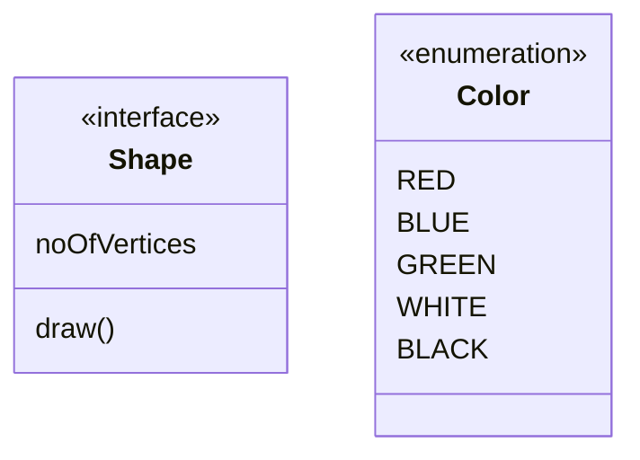
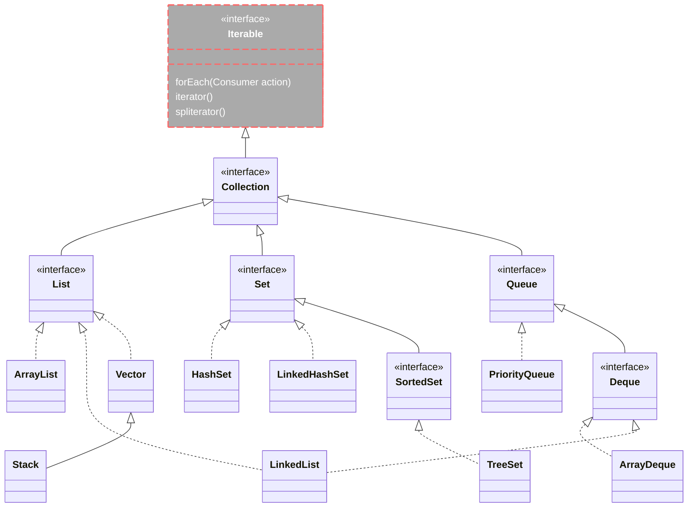

# Иерархия коллекций в Java

```mermaid
classDiagram
class Shape{
    <<interface>>
    noOfVertices
    draw()
}
class Color{
    <<enumeration>>
    RED
    BLUE
    GREEN
    WHITE
    BLACK
}


```

```mermaid
%% Иерархия коллекций Java (интерфейсы и классы)
classDiagram
  %% ===== Интерфейсы =====
  class Iterable:::interface {
    <<interface>>
    forEach(Consumer<? super T> action)
    iterator()
    spliterator()
  }
  class Collection {
    <<interface>>
  }
  class List {
    <<interface>>
  }
  class Set {
    <<interface>>
  }
  class SortedSet {
    <<interface>>
  }
  class Queue {
    <<interface>>
  }
  class Deque {
    <<interface>>
  }


  %% ===== Классы =====
  class ArrayList
  class LinkedList
  class Vector
  class Stack
  class HashSet
  class LinkedHashSet
  class TreeSet
  class PriorityQueue
  class ArrayDeque

  %% ===== Наследование Collection =====
  Iterable <|-- Collection
  Collection <|-- List
  Collection <|-- Set
  Collection <|-- Queue
  List <|.. ArrayList
  List <|.. LinkedList
  List <|.. Vector
  Vector <|-- Stack
  Set <|.. HashSet
  Set <|.. LinkedHashSet
  Set <|-- SortedSet
  SortedSet <|.. TreeSet
  Queue <|.. PriorityQueue
  Queue <|-- Deque
  Deque <|.. ArrayDeque
  Deque <|.. LinkedList

  classDef interface fill:#aaa,stroke:#f66,stroke-width:2px,color:#fff,stroke-dasharray: 10 5

```