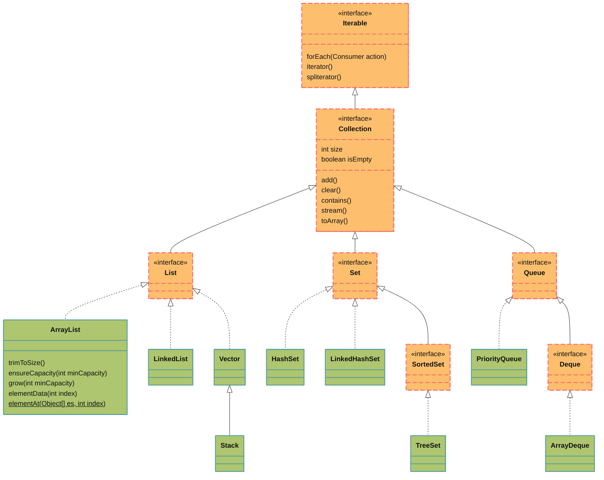

# Иерархия коллекций в Java

```mermaid
%% Иерархия коллекций Java (интерфейсы и классы)
classDiagram
  %% ===== Интерфейсы =====
  class Iterable:::interface {
    <<interface>>
    forEach(Consumer<? super T> action)
    iterator()
    spliterator()
  }
  class Collection:::interface {
    <<interface>>
    int size
    boolean isEmpty
    add()
    clear()
    contains()
    stream()
    toArray()
  }
  class List:::interface {
    <<interface>>
  }
  class Set:::interface {
    <<interface>>
  }
  class SortedSet:::interface {
    <<interface>>
  }
  class Queue:::interface {
    <<interface>>
  }
  class Deque:::interface {
    <<interface>>
  }


  %% ===== Классы =====
  class ArrayList:::clazz {
	  trimToSize()
	  ensureCapacity(int minCapacity)
	  grow(int minCapacity)
	  elementData(int index)
	  elementAt(Object[] es, int index)$
  }
  class LinkedList:::clazz
  class Vector:::clazz
  class Stack:::clazz
  class HashSet:::clazz
  class LinkedHashSet:::clazz
  class TreeSet:::clazz
  class PriorityQueue:::clazz
  class ArrayDeque:::clazz

  %% ===== Наследование Collection =====
  Iterable <|-- Collection
  Collection <|-- List
  Collection <|-- Set
  Collection <|-- Queue
  List <|.. ArrayList
  List <|.. LinkedList
  List <|.. Vector
  Vector <|-- Stack
  Set <|.. HashSet
  Set <|.. LinkedHashSet
  Set <|-- SortedSet
  SortedSet <|.. TreeSet
  Queue <|.. PriorityQueue
  Queue <|-- Deque
  Deque <|.. ArrayDeque

classDef interface fill:#fdbf6e,stroke:#f66,stroke-width:2px,color:#111,stroke-dasharray: 10 5
classDef clazz fill:#aec670,stroke:#5ba199,stroke-width:2px,color:#111
```