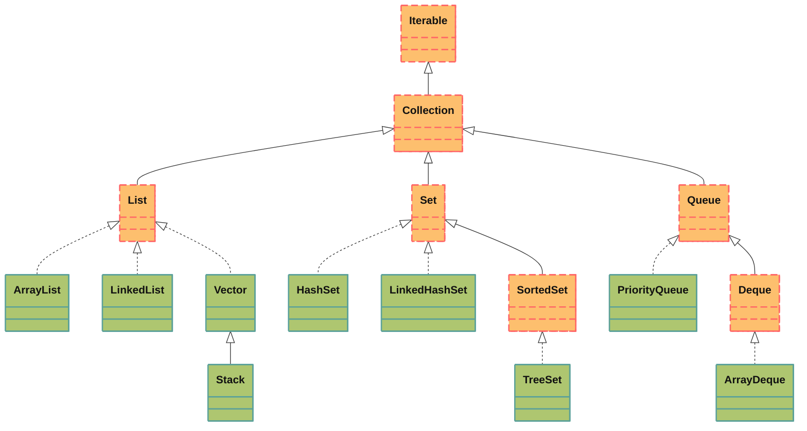

# Иерархия коллекций в Java


# Set
**Set** - это интерфейс в Java, который представляет собой коллекцию, не содержащую дубликатов элементов.
## Основные характеристики:
- Не допускает дублирования элементов (все элементы уникальны)
- Может содержать не более одного *null* элемента.
- Не гарантирует порядок элементов (за исключением некоторых реализаций)
## Основные реализации Set:
### 1. HashSet:
- Наиболее часто используемая реализация
- Хранит элементы в хэш-таблице
- Не гарантирует порядок элементов
- Обеспечивает быстрый доступ к элементам (*О(1)* для основных операций)
- Потокобезопасна
```java
Set<String> hashSet = new HashSet<>();
hashSet.add("Apple");
hashSet.add("Banana");
hashSet.add("Apple"); // Не будет добавлено
```
### 2. LinkedHashSet:
- Сохраняет порядок вставки элементов
- Немного медленнее *HashSet* из-за дополнительных затрат на поддержание связного списка
- Полезен когда важен порядок итерации
```java
Set<String> linkedHashSet = new LinkedHashSet<>();
linkedHashSet.add("First");
linkedHashSet.add("Second");
linkedHashSet.add("Third");
// Итерация будет в порядке добавления
```
### 3. TreeSet
- Хранит элементы в отсортированном порядке (по возрастанию)
- Реализован на основе красно-черного дерева
- Время выполнения операции *О(log n)*
- Может использовать Comparator для сортировки
```java
Set<String> treeSet = new TreeSet<>();
treeSet.add("Zebra");
treeSet.add("Apple");
treeSet.add("Banana");
// Элементы будут отсортированы: Apple, Banana, Zebra
```
## Основные методы Set:
- **add(E e)** - добавляет элемент, если его еще нет в множестве
- **remove(Object o)** - удаляет указанный элемент
- **contains(Object o)** - проверяет наличие элемента
- **size()** - возвращает количество элементов
- **isEmpty()** - возвращает логический ответ, пуст ли набор
- **clear()** - удаляет все элементы
- **iterator()** - возвращает итератор по элементам
## Особенности использования:
1. Проверка на дубликаты: *Set* использует методы *equals() и hashCode()* для определения дубликатов. Поэтому важно правильно их реализовать для объектов, которые вы храните в *Set*.
2. Сравнение с *List*:
	- *List* допускает дубликаты, *Set* - нет.
	- *List* сохраняет порядок вставки (кроме некоторых реализаций), *Set* - не всегда
	- Доступ по индексу есть только в *List*
3. Потокобезопасность: Стандартные реализации *Set* не потокобезопасны. Для многопоточного доступа можно использовать:
	- `Collections.synchronizedSet(new HashSet<>())`
	- `CopyOnWriteArraySet` (для редко изменяемых наборов)
	- `ConcurrentHashMap.newKeySet()`