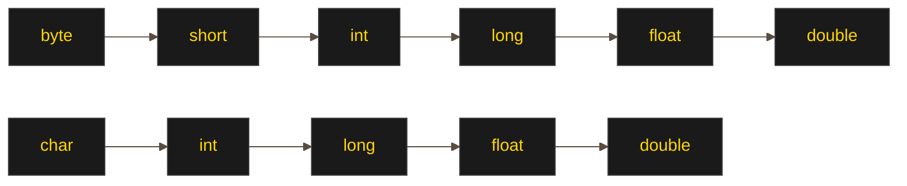

Приведение типов (type casting) - это процесс преобразования значения одного типа данных в другой тип. В Java существует два основных вида приведения типов:
# Неявное приведение (автоматическое, расширяющее преобразование)
Происходит автоматически, когда меньший тип преобразуется в больший без потери данных:
```java
int i = 100;
long l = i; // Автоматическое приведение int к long
double d = l; // Автоматическое приведение long к double
```
Неявное приведение возможно между совместимыми типами в следующих направлениях:
