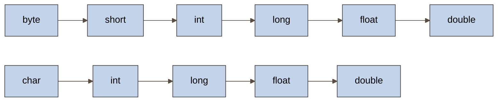

**Приведение типов (type casting)** - это процесс преобразования значения одного типа данных в другой тип. В Java существует два основных вида приведения типов:
# 1. Неявное приведение (автоматическое, расширяющее преобразование)
Происходит автоматически, когда меньший тип преобразуется в больший без потери данных:
```java
int i = 100;
long l = i; // Автоматическое приведение int к long
double d = l; // Автоматическое приведение long к double
```
Неявное приведение возможно между совместимыми типами в следующих направлениях:

# 2. Явное приведение (сужающее преобразование)
Требует явного указания типа и может привести к потере данных:
```java
double d = 100.04;
long l = (long)d; // Явное приведение, значение станет 100
int i = (int)l; // Явное приведение
```
# Особые случаи приведения типов
## Приведение объектов (reference type casting)
```java
class Animal {}
class Dog extends Animal {}

Animal a = new Dog(); // неявное приведение (upcasting)
Dog d = (Dog)a; // явное приведение (downcasting)
```
### Приведение с проверкой (instanceof)
Перед *downcasting* рекомендуется проверять тип:
```java
if(a instanceof Dog) {
	Dog d = (Dog)a;
}
```
## Автоупаковка и автораспаковка
Автоматическое преобразование между примитивами и их классами-обертками:
```java
Integer i = 10; // Автоупаковка (int -> Integer)
int j = i; // Автораспаковка (Integer -> int)
```
## Опасности приведения типов
1. Потеря точности при приведении чисел с плавающей точкой к целым.
2. *ClassCastException* при неправильном приведении объектов.
3. Переполнение при приведении больших чисел к меньшим типам.
**Приведение типов** - мощный инструмент, но требует осторожного использования для избежания ошибок времени исполнения.