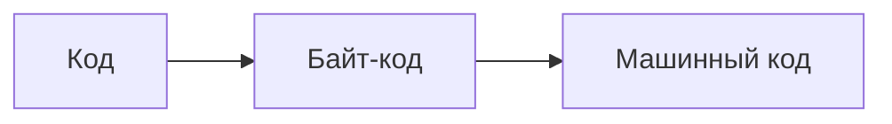
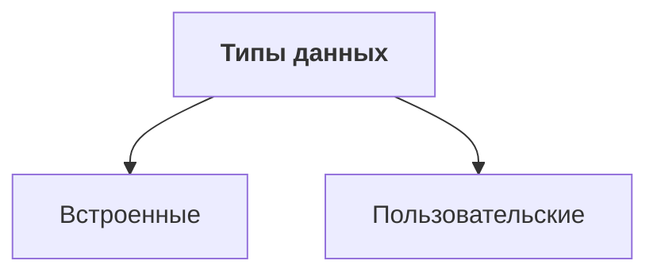
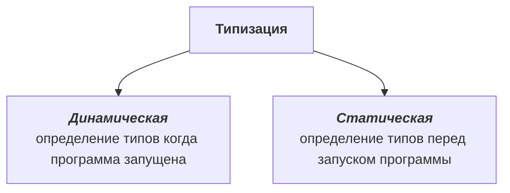
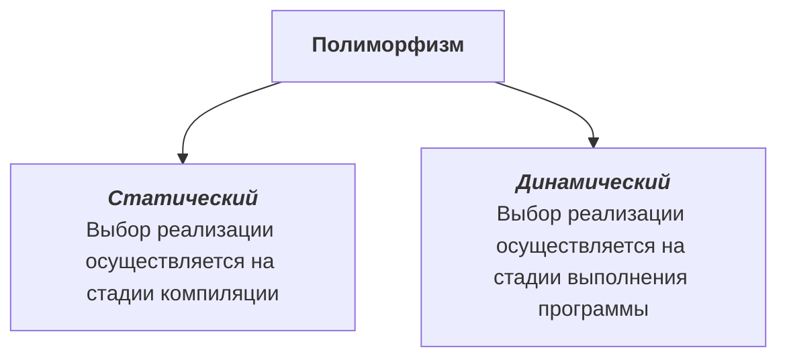
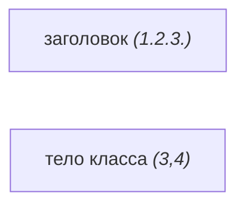
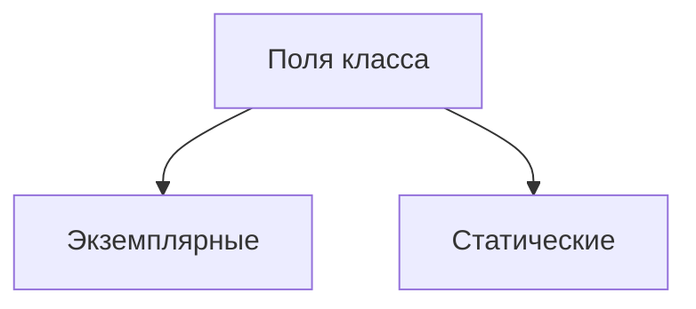

## Основные термины и понятия
#формальный_язык #компилятор #интерпретатор #парадигма_программирования #ООП #обобщенное_программирование #функциональное_программирование #процедурное_программирование

**Формальный язык** - язык, в котором значение каждого слова и знака, правила построения предложений и понимания их смысла однозначны.  

**Компилятор** - читает всю программу целиком, делает ее перевод и создает законченный вариант программы на машинном языке, который затем выполняется. Результат работы компилятора - бинарный исполняемый файл.

**Интерпретатор** - переводит и выполняет программу строка за строкой. После того, как программа откомпилирована, ни исходный текст программы, ни компилятор  более не нужны для исполнения программы. в то же время программа, обрабатываемая интерпретатором, должна заново переводиться на машинный язык при каждом очередном запуске программы. Т.е. каждый файл является исполняемым.

| Компилируемые                | Интепретируемые               |
| ---------------------------- | ----------------------------- |
| работают быстрее (Java, C++) | проще изменять (Java, Python) |

**Парадигма программирования** - это совокупность идей и понятий, определяющих общий подход к написанию программ. Парадигма определяет общую структуру программы, роль и взаимодействие составляющих ее компонентов, в частности систему типов данных.

**Объект-ориентированное программирование** - методология программирования, основанная на представлении программы в виде совокупности взаимодействующих объектов, каждый из которых является экземпляром определенного класса, а классы образуют иерархию наследования.

**Обобщенное программирование** - парадигма, заключающаяся в таком описании данных и алгоритмов, которое можно применять к различным типам данных, не меняя само это описание.

**Функциональное программирование** - парадигма программирования, в которой процесс вычисления трактуется как вычисление значений функций в математическом понимании последних (в отличии от функций как подпрограмм в процедурном программировании). Предполагает обходиться вычислением результатов функций от исходных данных и результатов других функций, и не предполагает явного хранения состояния программы. Соответственно, не предполагает и изменяемость этого состояния (в отличие от императивного, где одной из базовых концепций является ***переменная***, хранящая свое значение и позволяющая менять его по мере выполнения алгоритма).

**Процедурное программирование** - программирование на императивном языке, при котором последовательно выполняемые операторы можно собрать в подпрограммы, то есть
в более крупные целостные единицы кода, с помощью механизмов самого языка.

### Типы данных
#типы_данных

Тип данных определяет:
- Занимаемый размер памяти
- Множество допустимых значений
- Структуру памяти
- Набор определенных операций
- Способ интерпретации данных этого типа
- Допустимый контекст использования




**Целочисленный тип** - память интерпретируется как двоичное число.

**Вещественный тип** - память разбивается на две части: мантисса и степень.

**Объект** - находящийся  в памяти компьютера связанный набор данных вместе с определенным для него набором операций.
*Объект = данные объекта + операции объекта*
### Интерфейс
**Программный интерфейс объекта** - внешнее описание объекта. Описывается атрибутами и методами объекта, которые доступны для использования другими объектами.
### Ссылочные типы данных
**Ссылка** - переменная, или константа, которая содержит ссылку на какой-либо объект в памяти.

В Java можно:
- инициализировать ссылку
- обращаться к объекту по адресу ссылки
- присваивать ссылке адрес другого объекта (если ссылка не объявлена как константа)
### Принципы ООП
1. **Абстракция** - отделение концепции от экземпляра.
2. **Инкапсуляция** - открытый интерфейс, закрытая реализация.
3. **Наследование** - создание типов на основе существующих.
4. **Полиморфизм** - реализация одной задачи разными способами.

## Платформа Java
### Структура Java
- **Java Language**
- **Tools & Tool APIs** (java, javac, jar) - на всех платформах разные
- **JDK** - инструмент разработки
- **JRE** - инструмент выполнения
- **Java SE API**

**Java API *(Application Programming Interface)*** - это набор классов, разработанных компанией Sun для работы с языком Java. Этот интерфейс помогает при создании собственных  классов, апплетов и приложений.

**JDK *(Java Development Kit)*** - комплект разработчика приложений на языке Java, включающий в себя компилятор Java *(javac)*, стандартные библиотеки классов Java, примеры, документацию, различные утилиты и исполнительную систему *(JRE)*.

**JRE *(Java Runtime Environment)*** - минимальная (без компилятора и других средств разработки) реализация виртуальной машины, необходимая для  исполнения Java-приложений. Состоит из виртуальной машины JVM и библиотеки Java-классов.
### Структура платформы Java
- Спецификация языка Java
- Стандартные утилиты
- Стандартные пакеты
- Виртуальная машина
- Интегрированные среды разработки Java приложений *(IDE)* (Net Beans, Intellij Idea, Eclipse)
### Платформа Java
**Java SE *(Standard Edition)*** - стандартная редакция Java, которая используется для разработки простых Java-приложений. Например, можно создавать консольные приложения, апплеты, приложения с графическим интерфейсом.

**Java EE *(Enterprise Edition)*** - это редакция Java для разработки распределенных приложений масштаба предприятий. Включает в себя технологии EJB, JPA, Servlets, JMS и другие. До 6-й версии Java эта редакция имела название J2EE.

**Java ME *(Micro Edition)*** - это редакция Java для разработки приложений для микроконтроллеров.

**Oracle Java ME Embeded** - это среда выполнения Java, в которой используются основные технологии Java ME.

**Glassfish** - сервер для платформы Java EE

Документация по платформе Java SE 8 доступна по адресу: [https://docs.oracle.com/javase/8/](https://docs.oracle.com/javase/8/)
## Классы
**Класс** - в языке Java представляет собой пользовательский тип данных.
**Класс** - в объектно-ориентированном программировании, модель для создания объектов определенного типа, описывающая их структуру (набор полей и их начальное состояние) и определяющая алгоритмы (функции или методы) для работы с этими объектами.
### Схема определения класса
```java
1. спецификаторы class имя класса
2. extends имя суперкласса
3. implements список реализуемых интерфейсов {
4. члены класса
5. }

```
### Описание класса

В Java определение класса должно находиться в одном файле с расширением .java.

Имя класса должно с точностью до регистра соответствовать имени файла.

**Спецификаторы** - это ключевые слова языка, которые определяют некоторые особенности класса.
### Структура класса
В определение класса могут включаться элементы трех видов, которые именуются членами класса:
- переменные (поля, атрибуты)
- методы разъяснение
- конструкторы
### Общая схема определения атрибута класса
```java
private static int myVar = 7
```

### Общая схема определения метода

```java
public void myMethod (String str, int x) throws Exception{
тело метода
}
```
### Общая схема определения конструктора
```java
public MyClass (String str, int x) throws Exception{
тело метода
}
```
- Конструктор не возвращает значение.
- Имя конструктора с точностью до регистра должно совпадать с именем класса.
- Конструктор всегда вызывается автоматически при создании экземпляра.
### Списки формальных параметров методов и конструкторов
1. Пустой список 
```java 
myMethod()
```
2. Список с одним формальным параметром
```java 
myMethod(String str)
```
3. Список с несколькими формальными параметрами
```java 
myMethod(String str1, String str2, int x)
```
4. Список с формальным параметром переменной длины
```java 
myMethod(String str, int ... vars)
```

* В методе может быть только один аргумент переменной длины.
* Только последний аргумент метода может быть переменной длины.
* Согласно документации Java, не стоит перегружать метод с аргументом переменной длины.

**В Java нет значения параметра по умолчанию**
### Спецификаторы доступа
**Private** - наиболее строгий спецификатор доступа. Он ограничивает видимость данных и методов пределами одного класса.
**Protected** - поля и методы с таким модификатором будут видны:
- в пределах всех классов, находящихся в том же пакете, что и наш;
- в пределах всех классов-наследников нашего класса.

**Default** - (не обозначается ключевым словом, поскольку установлен в Java по умолчанию для всех полей и методов). Переменные и методы с таким модификатором видны всем классам пакета, в котором они объявлены, и только им.
**Public** - части кода с таким модификатором предназначаются для конечного пользователя.
## Создание объекта класса
### Схема инициализации атрибута класса ссылочного типа: